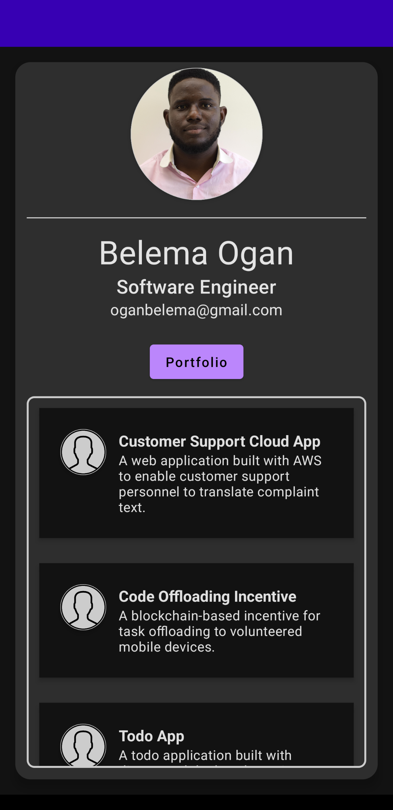
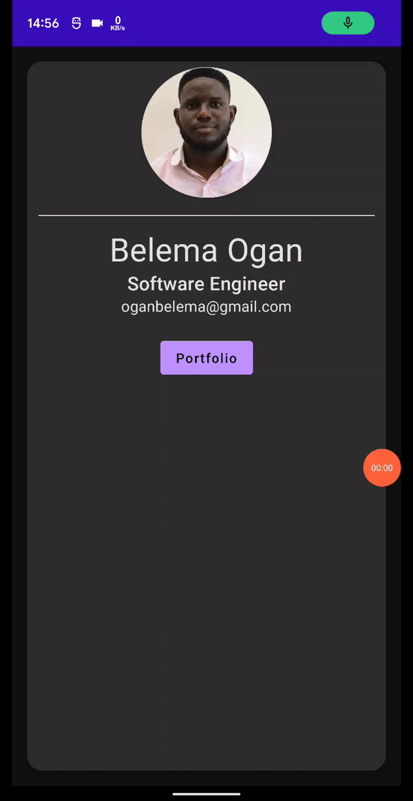

A Compose application from the Udemy course - Kotlin Android App Development: Firebase Firestore, 
Hilt & Dagger, ROOM DB, ViewModel, Navigation & Clean Architecture 

This is based on the BizCard app but contains some modified code.

